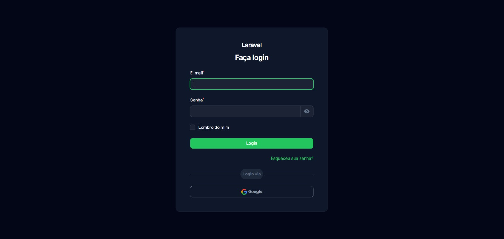
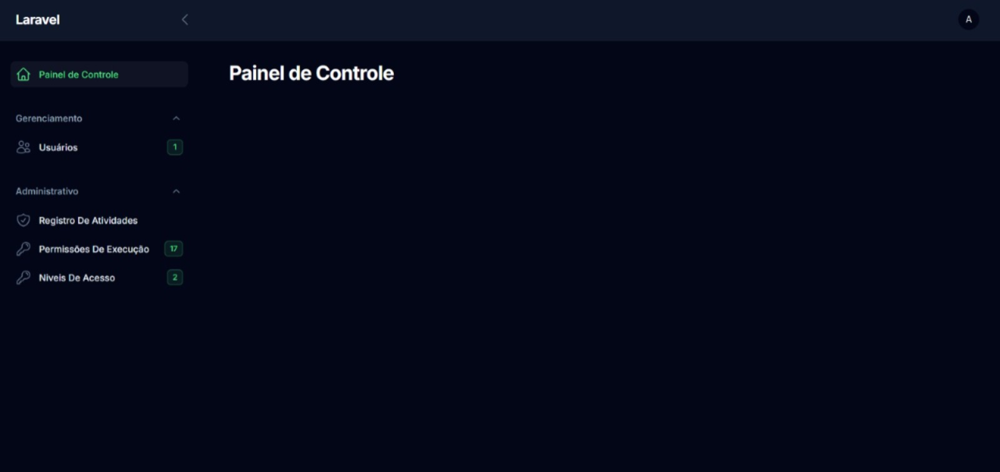
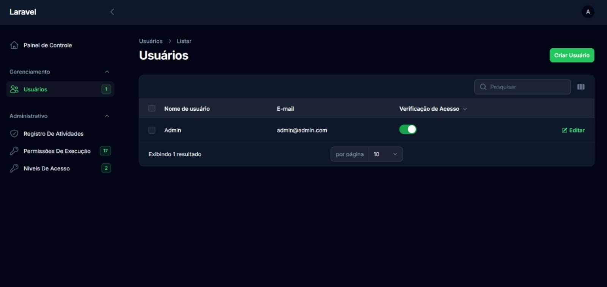
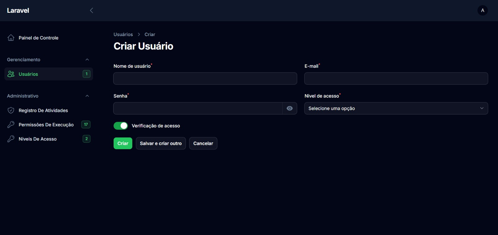
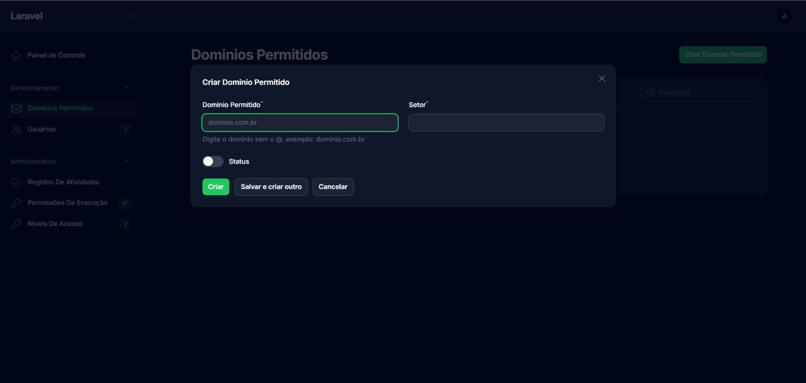
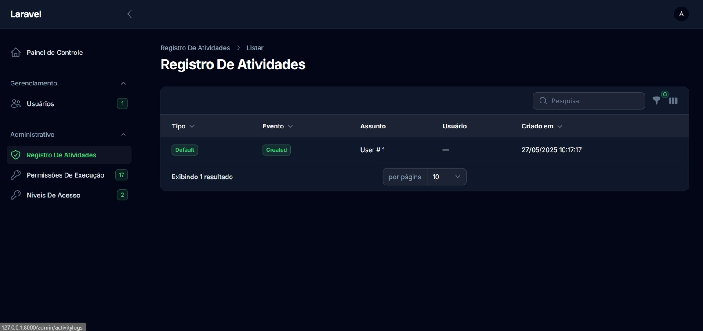
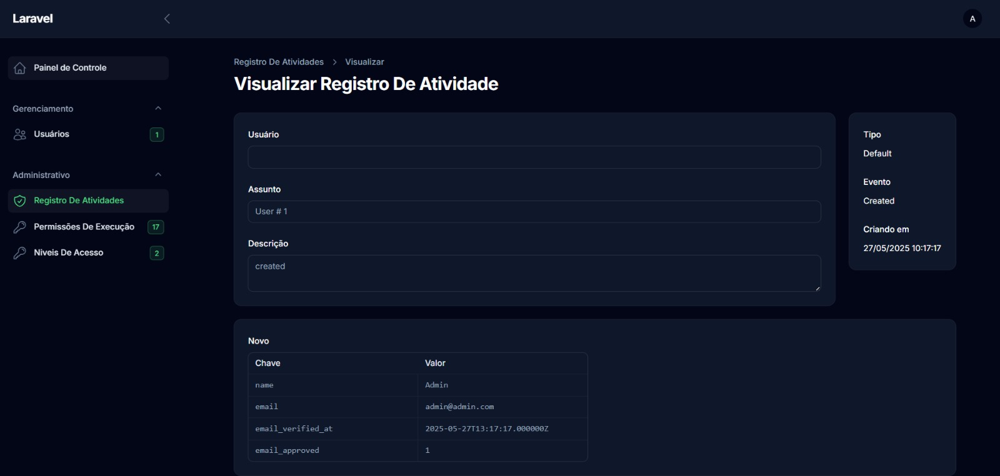
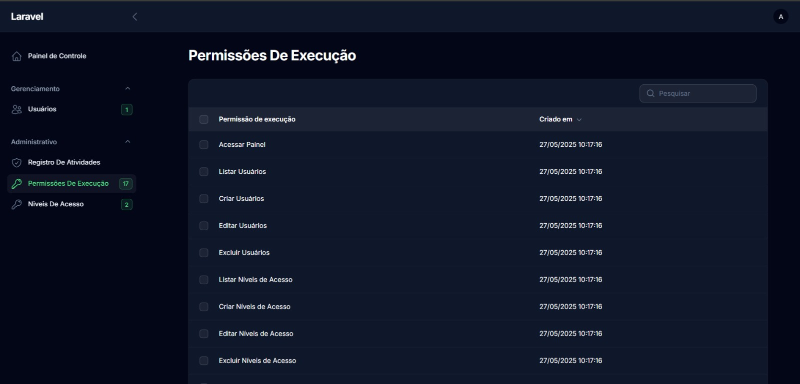
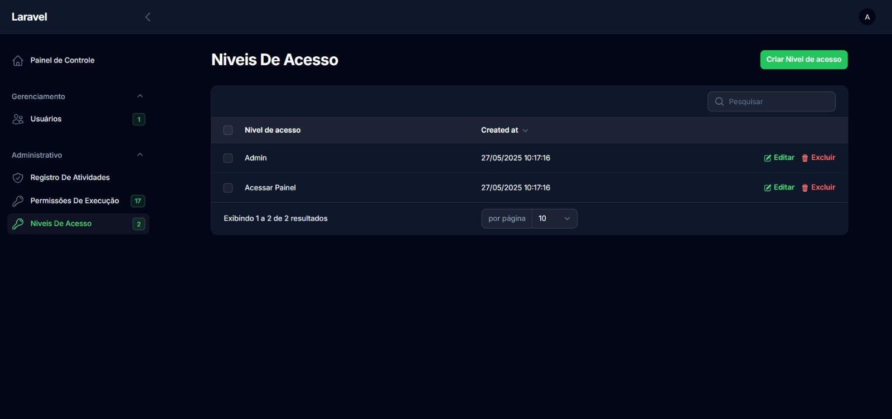

# 🚀 ACL Padrão com Filament

Este repositório contém um projeto Laravel 12 que implementa um sistema de Controle de Lista de Acesso (ACL) utilizando o painel administrativo Filament e o pacote Spatie Permission. O objetivo é fornecer uma base sólida para gerenciamento de usuários, papéis (roles) e permissões.

## 📜 Visão Geral

*   **Framework:** Laravel 12
*   **Painel Admin:** Filament 3.x
*   **Controle de Acesso:** Spatie Laravel Permission 6.x
*   **Login Social:** Dutch Coding Company Filament Socialite
*   **PHP:** 8.2+

O projeto oferece uma estrutura organizada para gerenciar o acesso a diferentes partes da sua aplicação, facilitando a criação de interfaces administrativas com Filament e permitindo login via Google.

## 🔑 Lógica de Permissões (Spatie Permission)

Este projeto utiliza o pacote `spatie/laravel-permission` para gerenciar o controle de acesso. A lógica principal se baseia em três componentes:

1.  **Usuários (Users):** Representam os indivíduos que interagem com o sistema.
2.  **Papéis (Roles):** Agrupam um conjunto de permissões. Funcionam como "funções" ou "cargos" dentro do sistema (ex: Administrador, Editor, Visitante).
3.  **Permissões (Permissions):** Definem ações específicas que podem ou não ser realizadas (ex: `criar post`, `editar usuário`, `ver relatório`).

A relação funciona da seguinte maneira:

*   Um **Usuário** pode ter um ou mais **Papéis** atribuídos.
*   Um **Papel** possui uma ou mais **Permissões** associadas a ele.
*   O sistema verifica se um **Usuário** tem uma determinada **Permissão**. Essa verificação pode ser direta (permissão atribuída diretamente ao usuário) ou, mais comumente, indireta: o sistema verifica se algum dos **Papéis** do usuário possui a **Permissão** necessária.

**Exemplo:**

*   O usuário "João" tem o papel "Editor".
*   O papel "Editor" tem as permissões "criar post" e "editar post".
*   Quando João tenta criar um post, o sistema verifica: João tem a permissão "criar post"? Sim, pois ele tem o papel "Editor", que por sua vez possui essa permissão.

Essa estrutura oferece flexibilidade para gerenciar o acesso de forma granular e organizada.

## 🛠️ Pré-requisitos

Antes de começar, garanta que seu ambiente de desenvolvimento atenda aos seguintes requisitos:

*   **PHP:** Versão 8.2 ou superior.
    ```bash
    php -v
    ```
*   **Composer:** Gerenciador de dependências para PHP. ([Instrução de Instalação](https://getcomposer.org/))
*   **Conexão com a Internet:** Para baixar as dependências.
*   **Banco de Dados:** Um SGBD compatível com Laravel (MySQL, PostgreSQL, SQLite, etc.).
*   **Configuração PHP.INI:** Verifique a seção específica sobre `php.ini` abaixo.

## ⚙️ Configuração do PHP (php.ini)

Para garantir o correto funcionamento da aplicação e de suas dependências (como extensões necessárias para o Laravel e pacotes específicos), é crucial que a configuração do seu PHP (arquivo `php.ini`) esteja adequada.

**Recomendações:**

*   **Extensões Essenciais:** Certifique-se de que extensões comuns para Laravel estejam habilitadas. Exemplos incluem: `pdo_mysql` (ou o driver do seu banco), `mbstring`, `xml`, `curl`, `gd`, `zip`, `fileinfo`, `openssl`.
*   **Limites de Recursos:** Ajuste diretivas como `memory_limit`, `max_execution_time`, `upload_max_filesize`, `post_max_size` conforme as necessidades da sua aplicação. Valores muito baixos podem causar erros inesperados.
*   **Arquivo de Referência:** Um arquivo `php.ini` com configurações adequadas para desenvolvimento foi fornecido como referência. Você pode comparar com o seu `php.ini` ativo ou utilizá-lo como base. Para localizar o `php.ini` ativo no seu sistema, execute:
    ```bash
    php --ini
    ```
    *(O arquivo `php.ini` de referência foi anexado na mensagem anterior.)*

## ⚙️ Passos para Instalação e Configuração

Siga estas etapas para configurar o projeto localmente:

1.  **Clonar o Repositório:**
    Obtenha o código-fonte do projeto.
    ```bash
    git clone https://github.com/GabrielCapoia-Dev/ACL-Padrao-Filament.git
    ```
    Ou baixe o ZIP diretamente do GitHub.

2.  **Navegar para o Diretório:**
    Entre na pasta do projeto recém-clonado.
    ```bash
    cd ACL-Padrao-Filament
    ```

3.  **Instalar Dependências:**
    Use o Composer para instalar os pacotes PHP necessários.
    ```bash
    composer install
    ```

4.  **Configurar Variáveis de Ambiente (.env):**
    Copie o arquivo de exemplo `.env.example` para `.env`.
    ```bash
    # Linux / macOS
    cp .env.example .env

    # Windows (prompt de comando)
    copy .env.example .env
    ```
    Abra o arquivo `.env` e configure as variáveis principais:
    *   **Banco de Dados:** Configure `DB_CONNECTION`, `DB_HOST`, `DB_PORT`, `DB_DATABASE`, `DB_USERNAME`, `DB_PASSWORD` de acordo com seu ambiente.
    *   **URL da Aplicação:** Defina `APP_URL` para a URL base da sua aplicação (ex: `APP_URL=http://localhost:8000`).

    #### Configuração Adicional: Login Social com Google

    Para habilitar o login com Google, você precisará obter credenciais no Google Cloud Console e adicioná-las ao seu arquivo `.env`.

    1.  Acesse o [Google Cloud Console](https://console.cloud.google.com/).
    2.  Crie ou selecione um projeto.
    3.  Vá para "APIs e Serviços" > "Credenciais".
    4.  Crie uma credencial do tipo "ID do cliente OAuth".
    5.  Selecione "Aplicativo da Web".
    6.  Configure as "Origens JavaScript autorizadas" (ex: `http://localhost:8000`).
    7.  Configure os "URIs de redirecionamento autorizados". Adicione a URL de callback: `[SUA_APP_URL]/oauth/google/callback` (ex: `http://localhost:8000/oauth/google/callback`).
    8.  Copie o **Client ID** e o **Client Secret** gerados.

    Adicione as seguintes linhas ao seu arquivo `.env`, substituindo pelos valores obtidos:

    ```dotenv
    GOOGLE_CLIENT_ID=SEU_CLIENT_ID_AQUI
    GOOGLE_CLIENT_SECRET=SEU_CLIENT_SECRET_AQUI
    GOOGLE_REDIRECT_URI=SUA_URL_DE_REDIRECIONAMENTO_AQUI # Ex: http://localhost:8000/oauth/google/callback
    ```

5.  **Gerar Chave da Aplicação:**
    Gere a chave de segurança única para a aplicação.
    ```bash
    php artisan key:generate
    ```

6.  **Configurar Banco de Dados (Migrate & Seed):**
    Execute as migrações para criar as tabelas e os seeders para popular o banco com dados iniciais (incluindo o usuário admin).
    ```bash
    php artisan migrate:refresh --seed
    ```
    *Nota: `migrate:refresh` apaga todas as tabelas e as recria. Use `php artisan migrate --seed` se preferir apenas aplicar novas migrações e popular um banco já existente.* 

## ▶️ Executando a Aplicação

Após a configuração, inicie o servidor de desenvolvimento local do Laravel:

```bash
php artisan serve
```

A aplicação estará acessível na URL definida em `APP_URL` (por padrão, `http://127.0.0.1:8000`).

## 🔑 Acessando o Painel Administrativo

1.  Abra seu navegador e acesse a URL da aplicação seguida de `/admin` (ex: `http://127.0.0.1:8000/admin`).
2.  Utilize as credenciais padrão criadas pelo seeder:
    *   **Email:** `admin@admin.com`
    *   **Senha:** `123456`
3.  Você também pode usar a opção de login com Google se configurou as credenciais no passo 4.
4.  Após o login, você terá acesso ao painel do Filament para gerenciar usuários, papéis e permissões.

## 🖼️ Telas do Projeto

Tela de login com o funcionalidade de login através do google.

**Tela de Login:**




Tela de Dashboard aonde você pode colocar informações do seu projeto.

**Tela Dashboard:**




Tela de Gerenciamento de Usuários aonde você pode gerenciar os usuários do seu projeto.

**Tela de Gerenciamento de Usuários:**




Tela de Criação Dedicada, segue um padrão de estrutura do Filament, ideal para cadastros com muitas informações. Caso você queira um gerenciamento mais simles é possivel utilizar o comando:

```bash
php artisan make:filament-resource Customer --simple
```
Seguindo assim o padrão da documentação do FilamentPHP, esse comando com a tag `--simple` faz com que os formulários sejam através de um modal que aparece na tela com os campos para preenchimento

**Tela de Criação Dedicada:**



**Tela de Criação Simplificada:**



**Tela de Registro de Atividades:**



**Tela de Detalhes do Registro de Atividades:**



**Tela de Permissões:**



**Tela de Niveis de Acesso:**



## ✅ Considerações Finais

Este projeto serve como um ponto de partida robusto para aplicações Laravel que necessitam de controle de acesso detalhado com uma interface administrativa moderna.  

Sinta-se à vontade para adaptar e expandir conforme suas necessidades, lembrando sempre de seguir as documentações oficiais de cada biblioteca que estiver no projeto:

- [**Laravel**](https://laravel.com/docs)  
- [**FilamentPHP**](https://filamentphp.com/docs)  
- [**Spatie**](https://spatie.be/docs/laravel-permission/v6/basic-usage/basic-usage)  

Bom desenvolvimento! 👍


